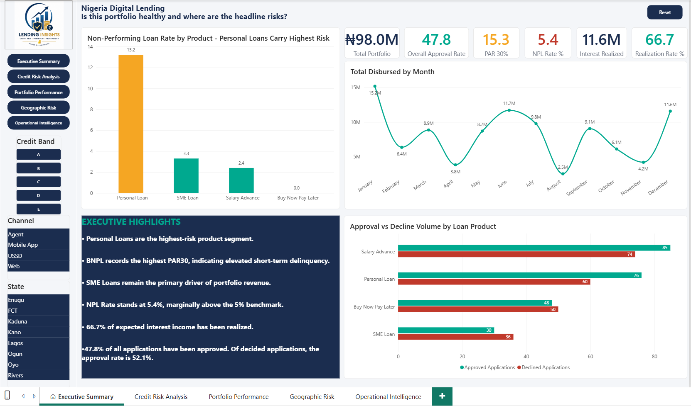
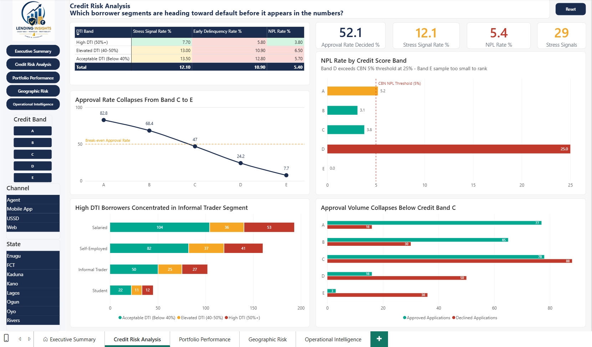
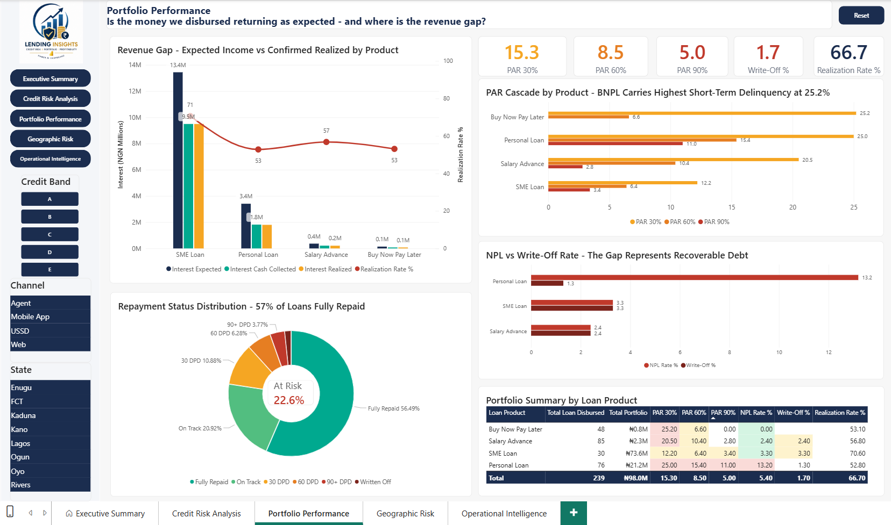
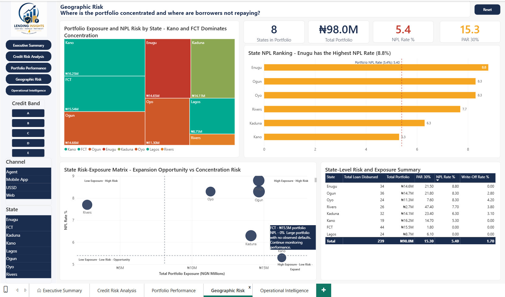
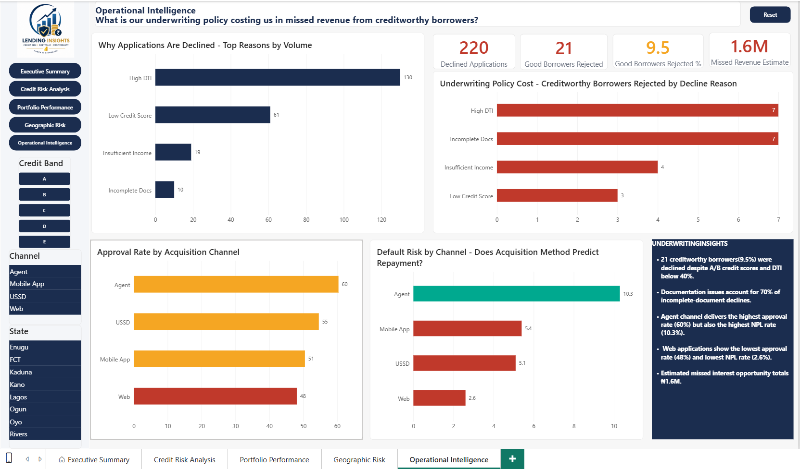

# Nigeria Digital Lending — Credit Risk Intelligence Dashboard

## Business Problem

Nigerian digital lenders and commercial banks face significant portfolio risk management challenges as digital credit scales rapidly. This project models how a risk team at a Nigerian fintech would monitor a live loan portfolio — tracking delinquency, default rates, revenue realization, and early warning signals before they appear in headline NPL metrics.

## Dataset

Synthetic dataset of 500 loan applications and 239 disbursed loans across four products (Salary Advance, Personal Loan, SME Loan, Buy Now Pay Later) in eight Nigerian states. Dataset structure reflects real Nigerian digital lending product design, CBN regulatory thresholds, and IFRS 9 classification logic.

**Products:** Salary Advance | Personal Loan | SME Loan | Buy Now Pay Later  
**States:** Lagos, FCT, Oyo, Rivers, Ogun, Kano, Kaduna, Enugu  
**Channels:** Mobile App | USSD | Web | Agent

## Tools

- **SQL:** DB Browser for SQLite — 9 queries covering portfolio analysis, risk segmentation, and early warning detection
- **Power BI:** 5-page dashboard — Executive Summary, Credit Risk Analysis, Portfolio Performance, Geographic Risk, Operational Intelligence

## Key Findings

| Metric | Value |
|--------|-------|
| Total Portfolio | ₦98.0M |
| Overall NPL Rate | 5.4% (above CBN 5% prudential threshold) |
| PAR30 | 15.3% |
| Interest Realization Rate | 66.7% |
| Pre-Default Stress Signals | 29 loans (12.1%) |
| Creditworthy Borrowers Incorrectly Declined | 21 (₦1.6M missed revenue) |

**Headline insights:**
- Personal Loans carry 13.2% NPL — the primary risk driver in the portfolio
- BNPL shows 25.2% PAR30 with zero confirmed defaults — explained by 14–30 day tenor and high self-cure rates
- FCT has zero confirmed defaults on ₦15.5M exposure — clearest geographic expansion signal
- Incomplete Docs declines show a 70% false-positive rate for creditworthy borrowers — a process failure, not a credit policy failure

## SQL Queries

| Query | Purpose |
|-------|---------|
| Q1 — Application Funnel | Approval rates by credit score band |
| Q2 — Portfolio at Risk (Overall) | PAR30, PAR60, PAR90 on total portfolio |
| Q3 — PAR by Loan Product | Risk disaggregated by product |
| Q4 — Default Rate Analysis | NPL rate and write-off rate by product |
| Q5 — Interest Income & Profitability | Expected vs cash collected vs realized revenue |
| Q6 — Geographic Credit Risk | State-level exposure and default concentration |
| Q7 — Decline Reason Analysis | Distribution of underwriting rejection reasons |
| Q8 — Missed Opportunities | Creditworthy borrowers incorrectly declined |
| Q9 — Early Warning Stress Matrix | Forward-looking pre-default risk identification |

## Dashboard Pages

## Analytical Approach

This project applies standard credit risk frameworks used by regulated Nigerian lenders:

- **PAR methodology** calculated on loan values (not counts) per microfinance best practice
- **NPL definition** includes both 90+ DPD and Written Off per Basel II/III and IFRS 9 standards
- **CBN 5% NPL threshold** used as reference benchmark throughout
- **IFRS 9 staging logic** applied in Q9 — identifying Stage 2 migration signals before confirmed Stage 3 default
- **Three-view interest income model** (Expected / Cash Collected / Realized) mirrors how lending CFOs measure revenue quality

## How to Run the SQL Queries

1. Install DB Browser for SQLite (free at sqlitebrowser.org)
2. Convert `data/Loan_Applications.csv` and `data/Loan_Performance.csv` to tables in a new `.db` file
3. Import settings: Column names in first row ON, UTF-8, comma delimiter, trim fields ON
4. Click Write Changes immediately after import
5. Open `sql/Nigeria_Credit_Risk_Queries.sql` and run each query

## About

Built by Adetunji Adesibikan as part of a data analytics portfolio targeting credit risk and fintech BI roles. Commercial context draws from 4+ years as Trade & Key Account Manager at Henkel AG Nigeria (Fortune Global 500), with direct experience of how Nigerian retail and financial markets respond to macroeconomic pressure.

[LinkedIn](https://www.linkedin.com/in/adetunjiadesibikan/) | [Portfolio](https://github.com/adetunjiadesibikan/nigeria-fmcg-outlet-analysis)
